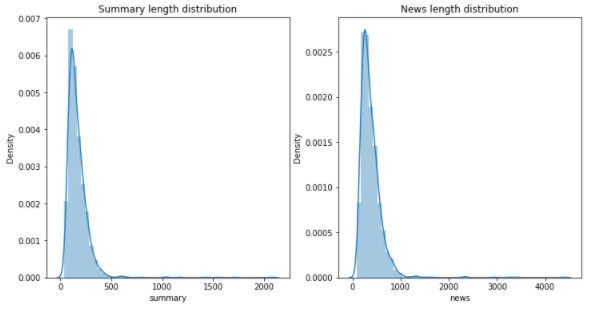
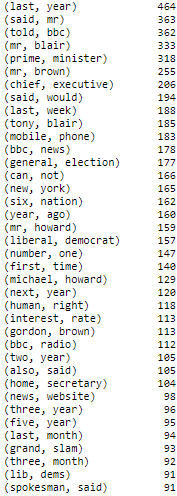
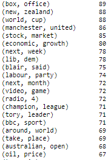
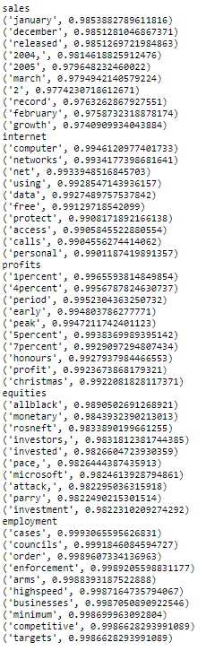

# NEWSY for summarising news articles

## 1. Overview
News articles can sometimes be really lengthy, and not everyone has the time to thoroughly read news articles on a regular basis. This app was created with the sole purpose of helping users accurately summarise news articles on the fly. Conveniently, it is also able to pull the top 10 news articles daily.

App can be found at the URL here:
https://text-summariser-newsy.herokuapp.com/

__Folder structure__

    ├── img
    ├── notebooks
    │   ├── A8_EDA_cleaning.ipynb
    │   ├── BertModel.ipynb
    │   ├── eda.ipynb
    │   └── ExtractiveModel.ipynb
    ├── src
    │   ├── app.py
    │   ├── helper.py
    │   ├── sample_summariser.py
    │   ├── inference.py
    │   ├── templates
    │   ├── static
    │   ├── datapipeline
    │   │   ├── loader.py
    │   │   └── preprocess.py
    │   └── modelling
    │       ├── saved_models
    │       │   └── model_sumy.sav
    │       ├── model.py
    │       ├── model_hf.py
    │       └── model_sumy.py
    ├── conda.yml
    ├── Dockerfile
    ├── LICENCE
    ├── Procfile
    ├── README.md
    └── requirements.txt


## 2. EDA

__Dataset__
- BBC news articles from 2004 to 2005 were used
- Created with a dataset used for data categorization 
- Contains 2225 documents of news articles and their summaries
- In .txt format, which was converted to .csv format
- Involves 5 categories of news: Sport (511 documents), Business (510 documents), Politics (417 documents), Technology (401 documents), Entertainment (336 documents)

**Summary Length Distribution & News Length Distribution**



The length of the summary given in the dataset are mostly below 500 words, while the news article are mostly below 1000 words.

**N-grams**

N-gram model predicts occurence of word based on the occurence of its N-1 previous words. Some of the words that were grouped together were:

 


Some of the words that are found together that makes sense are (last,year), (mobile,phone), (new,york), etc.

**Word2vec**

Some exploration has also been done using word embedding with Word2Vec model.



**Data Cleaning** 
- remove '\n', '\BA', parenthesis, multiple spaces, artifacts (e.g. '\'), various 'xa-' and 'xc2' that has not much meaningful insights
 - substituted '$' with USD as dollar signs here in BBC news refers to US Dollars
 - substituted '%' with 'percent'


## 3. Model

4 models were tested. Details of each are below.

1. NLTK Summarizer:
    - A simple NLTK extractive summarizer that is used as a baseline model for comparison against the better pretrained models
    - Uses weightage scores of each words to determine the scores of each sentence in the summary to generate a ranking for each sentence before output
    - Summary will be generated based on the scoring of each sentences and the number of sentences chosen can be adjusted

2. Bert Model: 
    - A pretrained BERT summarizer model that was trained on SciBERT(BERT model trained on scientific text)
    - The training corpus was papers taken from Semantic Scholar. Corpus size is 1.14M papers, 3.1B tokens. Full text of the papers in training (not just abstracts)
    - Additional layers can be added and trained in the future to further improve the evaluation score

3. KL-Sum Model (extractive):
    - Selects sentences based on similarity of a sentence's word distribution against the full text
    - Greedy algorithm
    - Seeks to minimise the KL (Kullback–Leibler) divergence

4. T5 Transformer Model (abstractive):
    - Pretrained on C4 (Colossal Clean Crawled Corpus), 700GB
    - T5 base model with LM on top was used, finetuned on a news summary dataset

### 3a. Expected input format required by model
All of the 4 models require text data as input and generate summarized text data as output. Preprocessing of the data will be done before being passed through the model.

### 3b. Model Performance
Bertscore and ROUGE were used to evaluate model performance.
- For Bertscore, the output summary is evaluated against the original text, using contextual embeddings for the tokens. Cosine similarity is then used to compute the matching, optionally weighted with idf.
- For ROUGE, it looks at how many n-grams in the reference summary shows up in the output summary, with 3 variations: Rouge-1 (unigrams), Rouge-2 (bigrams), Rouge-L (longest subsequence)

Below are the results for the 4 models:

__Bertscore__

                      precision    recall  f1-score

     NLTK Summarizer       0.93      0.86      0.89
                Bert       0.96      0.86      0.91
              KL-Sum       0.93      0.87      0.90
      T5 Transformer       0.93      0.83      0.88

__ROUGE-2__

                      precision    recall  f1-score

     NLTK Summarizer       0.46      0.39      0.41
                Bert       0.45      0.28      0.34
              KL-Sum       0.44      0.30      0.34
      T5 Transformer       0.38      0.19      0.24

__ROUGE-L__

                      precision    recall  f1-score

     NLTK Summarizer       0.55      0.51      0.52
                Bert       0.57      0.41      0.47
              KL-Sum       0.57      0.41      0.46
      T5 Transformer       0.57      0.34      0.42

__Findings__
- Results for all models are all comparable
- Output from NLTK model is quite similar to the reference summary, which could be a reason why the NLTK model has higher ROUGE scores
- T5 transformer has lower ROUGE scores, possibly due to a max token length of 512 i.e. for texts with >512 tokens it will be truncated
- KL-Sum model was chosen because of its speed in delivering results (<1s as compared to BERT ~12s and T5 ~2mins)


## 4. How the model is served
Among the 4 models, KL-Sum model was chosen for the web app. The model will be served via a Flask app to generate a summary of any given input text from the user. The app will then be hosted on Heroku.

__Deployment steps__

This uses a free template from [Start Bootstrap](https://startbootstrap.com/themes), Flask Backend, and deploy to Heroku PaaS.

There will be an app.py file created for the app deployment. Within it, the chosen model is called for generating the summary.
The predict function is to receive input text, call the model to summarize the input text, generates the summary and their respective word length. 

Example code:


```
@app.route('/', methods=['GET', 'POST'])

def predict():
    """Return Cell with Summary"""
    global CLEAN_SUMMARY
    summary = CLEAN_SUMMARY
    in_count = None
    out_count = None
    app.logger.info('Received Text Input')
    if request.method == 'POST':
        out = request.form['rawtext']
        summary = nltk_summarizer(out)
        in_count = len(request.form['rawtext'])
        out_count = len(summary.split())
    input_count_words = f"{in_count} words."
    output_count_words = f"{out_count} words."
    CLEAN_SUMMARY = summary
    return render_template('index.html', input_count=input_count_words, output=summary, output_count=output_count_words)
```
